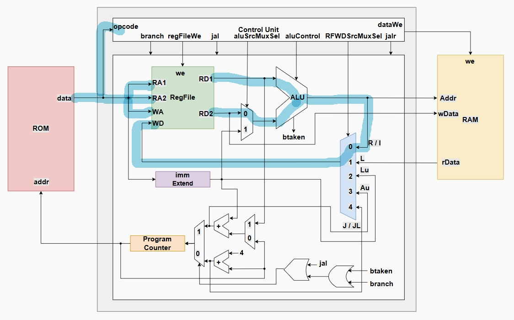
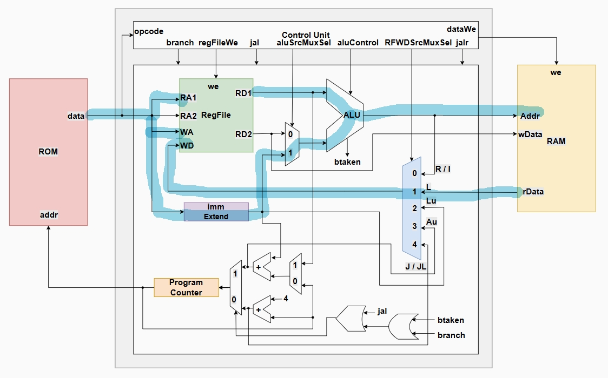
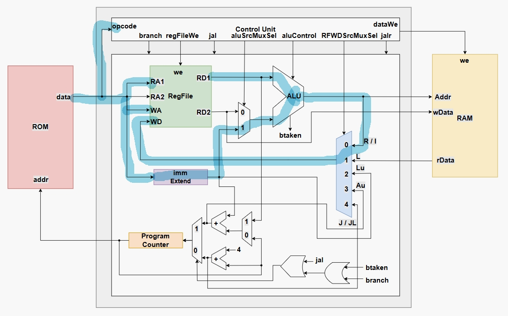
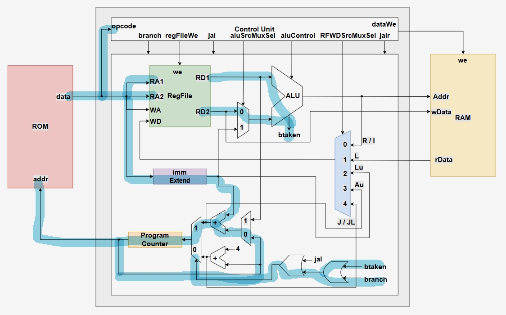
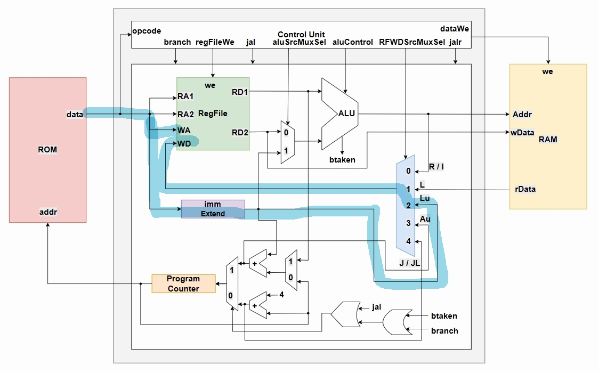
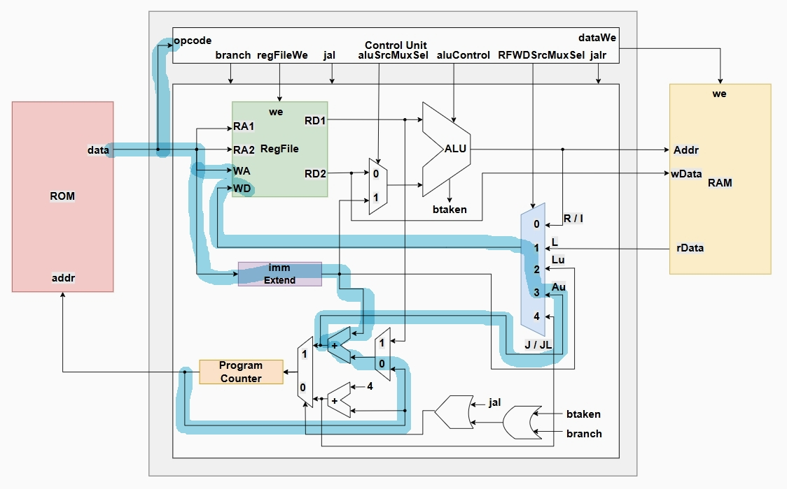
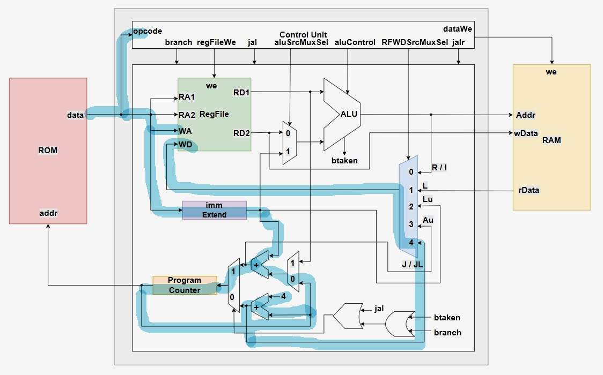
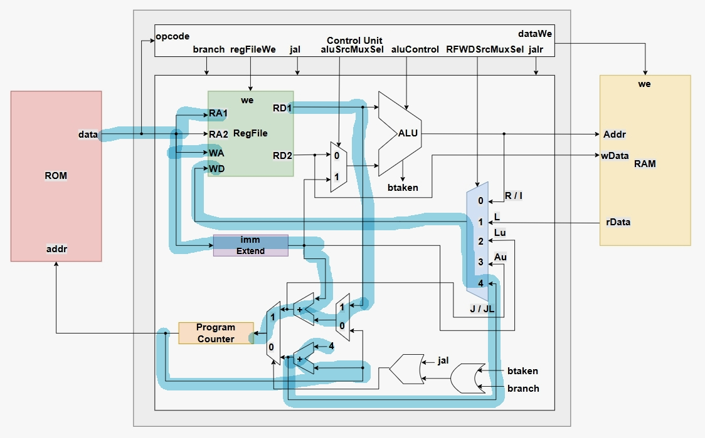

**study 폴더에 APB와 AXI4_Lite관련 내용이 있습니다.**

# RISC-V RV32I CPU 설계

## 개요
- **RISC-V** : RISC 기반의 오픈소스 명령어셋 아키텍처
- 본 프로젝트는 **RV32I 명령어셋 기반 CPU**를 직접 설계하고,
  C 코드(버블 정렬)를 실행시켜 검증하는 것을 목표로 함
- 설계 방식  
  - **Single Cycle Architecture**
  - **Multi Cycle Architecture** : 해당 프로젝트에서 채택

---

## 개발환경
- 언어: **SystemVerilog**
- 시뮬레이션: Vivado
- 문서: RISC-V ISA v2.2 스펙, RV32I Instruction Set Manual
- 자체 제작 CPU 구성  
  - ControlUnit  
  - DataPath  
  - ROM / RAM  

---

## 명령어 지원
- **R-Type**: `add`, `sub`, `and`, `or`, `xor`, `sll`, `srl`, `sra`, `slt`, `sltu`
- **I-Type**: `addi`, `slti`, `sltiu`, `xori`, `ori`, `andi`, `slli`, `srli`, `srai`
- **S-Type**: `sw`, `sb`, `sh`
- **L-Type**: `lb`, `lh`, `lw`, `lbu`, `lhu`
- **B-Type**: `beq`, `bne`, `blt`, `bge`, `bltu`, `bgeu`
- **LU-Type**: `lui`
- **AU-Type**: `auipc`
- **J-Type**: `jal`
- **JL-Type**: `jalr`

---

## RAM
- 필요 메모리 48(main) + 48(sort) + 48(swap) + $\alpha$
- 설정 메모리 256byte

## R_Type

- **rd = rs1 ?? rs2**


## L_Type

- **rd = M[rs1+imm]**

## I_Type

- **rd = rs1 ?? imm**

## S_Type

- **M[rs1+imm] = rs2**

## B_Type

- **if(rs1 == rs2) PC += imm**

## LU_Type

- **rd = imm << 12**

## AU_Type

- **rd = PC + (imm << 12)**

## J_Type

- **rd = PC + 4, PC += imm**

## JL_Type

- **rd = PC + 4, PC = rs1 + imm**

## 동작 과정 : Test Program (C, Bubble Sort)
1. `main` 48byte frame
   ```asm
   addi sp, sp, -48 : 프레임 생성
   ```
2. `sort` 48byte frame
3. `swap` 48byte frame
   ```asm
   addi sp, sp, 48 : 프레임 해제
   ```
