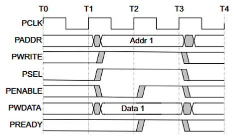
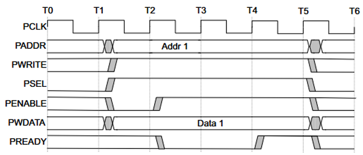
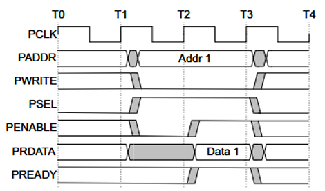
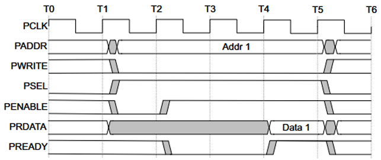
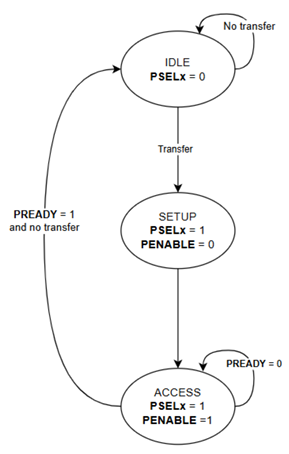
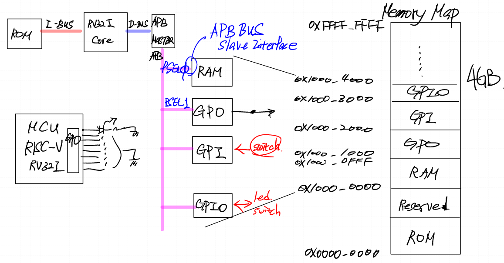
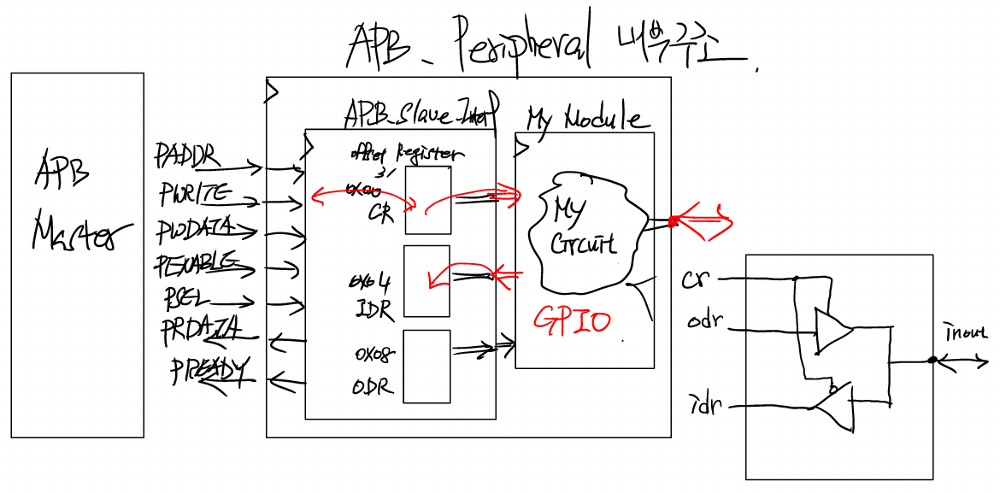

# APB 

## 개요
- low-cost 인터페이스
  - 간소화된 인터페이스
  - 저전력에 최적화 되어있는 프로토콜

## data sheet
### write : with no wait states

- t1에서 Setup stage
- t2 시점에 PENABLE 활성화 및 ACCESS 단계 시작
- T3 시점에서 전송이 완료되면 PENABLE이 deasserted 되고 PSEL 비활성화

---

### write : write : with wait states

- ACCESS 단계에서 PENABLE이 high인 동안 slave가 low를 유지하여 transfer 연장

---

### read : with no wait states

- slave는 read transfer가 끝나기 전에 read data를 제공해야 한다

---
### read : with wait

- ACCESS 단계에서 PREADY가 low가 되면 transfer 연장
  
---

## Operating States

- IDLE : default state
- SETUP : 전송이 필요해지면 peripheral을 PSEL를 통해 선택
- ACCESS : PENABLE 신호 활성화, slave가 PREADY신호를 주면 ACCESS 종료
  - PREADY가 low면, interface는 ACCESS 상태 유지
  - PREADY가 high가 되면 IDLE로 상태이동

## 동작 원리

1. APB MASTER에서 Memory Map은 주소별로 어떤 peripheral를 선택할지를 결정한다
2. 동작 시 APB MASTER가 Peripheral에게 broadcasting을 시전한다
3. 주소에 맞는 PSEL을 통해 모든 peripheral 중 선택받은 하나의 모듈만 동작하게 된다

## 구조

- GPIO를 예시로 하는 APB Peripheral 내부 구조
- APB_Peripheral는 APB_Slave_Interface와 My IP로 구성되어있다.
- APB_Slave_Interface는 주소에 따른 register로 구성되어있다. 