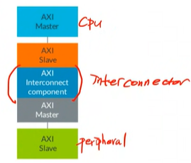
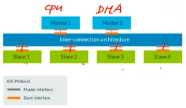
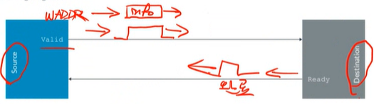
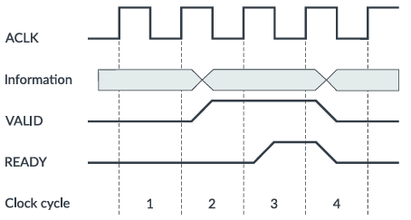
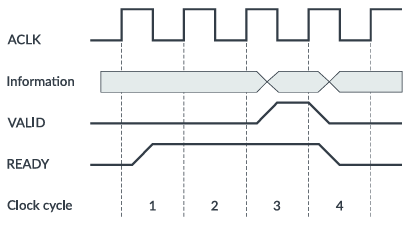
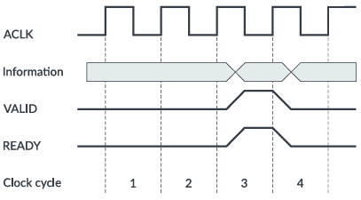
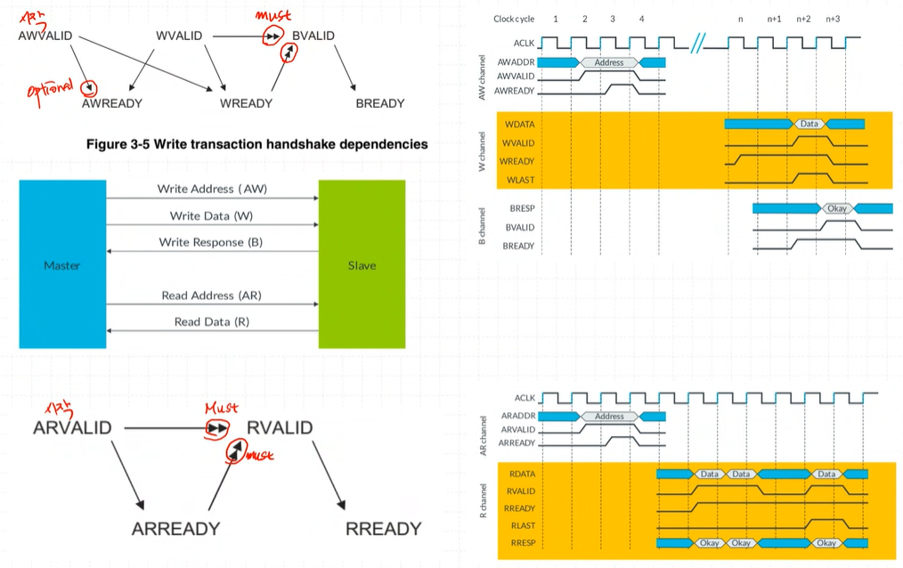
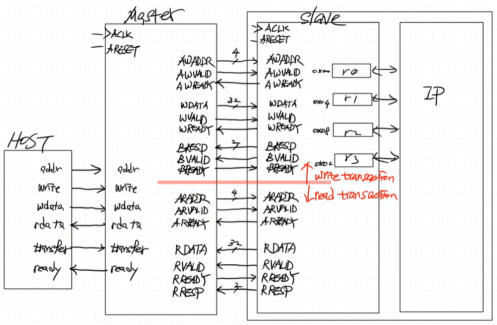

# 0904_AXI

## AXI protocol 
- AXI는 상호 연결 자체가 아닌 IP 블록의 인터페이스를 정의하는 인터페이스 사양
  
  
    - AXI는 point-to-point connections 이다. 즉, master - slave 간 broadcasting 하지않고 모듈을 딱 집어서 one by one으로 통신하게된다. 그림에서 master1이 slave1과 통신하는 동안, 동시에 master2와 slave2가 통신할 수 있다.

## AXI channels
- write 와 read가 물리적으로 분리되어 있으므로 write address 또는 read address를 통해 독립적으로 작동 가능
  ### Channel handshake (VALID and READY)
  - response (응답)을 포함한 상호작용 
  - source(데이터를 보내는 쪽) -> destination(데이터를 받는 쪽)
  
  ### transfers and transactions
  
  - VALID와 READY 신호가 둘다 High일 때 rising edge보고 (이 때 handshaking이라고 한다) low로 떨어진다. 
  
    - case 1
    -----
    
    - case 2
    -----------
    
    - case 3
    ---------
## 작동

## block diagram
