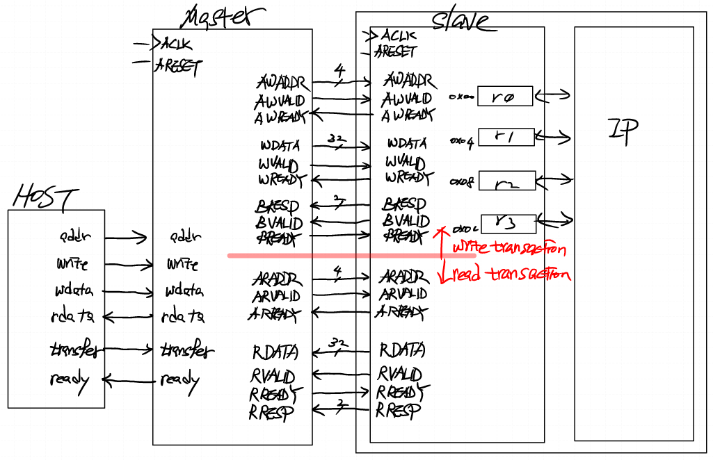
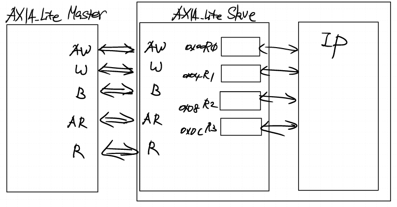
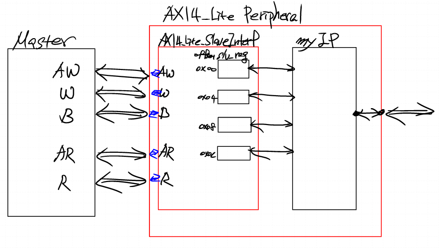
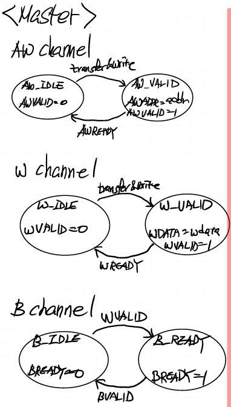
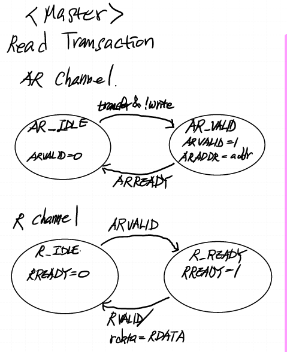
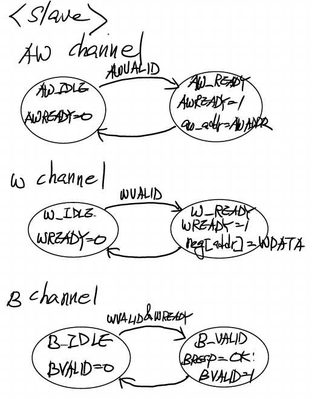
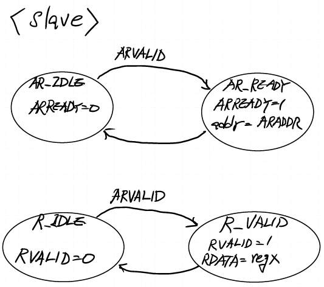

# 0905

## AXI4_Lite_Master_Slave
   

## AXI4_Lite_for_template
   

- 빨간색 상자가 xilinx vivado에서 지원해주는 AXI Template
  - 내 IP 넣고 선만 연결하면 된다

## State Machine   

### Master_Write   

---
### Master_Read   

---
### Slave_Write   

---
### Slave_Read   

---