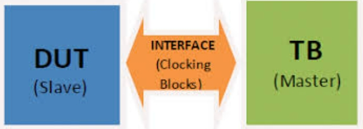
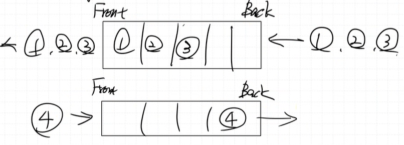

# System Verilog Verification

## dut_interface_tb


## Data Type
- 4-state (벡터) : 0, 1, x, z, logic, reg, wire
- 2-state (벡터) : 0, 1, bit
- 4-state (정수) : integer(32bit)
- 2-state (정수) : byte(8), shortint(16), longint(64)

## 배열 (array)_sw
### 고정 길이 배열 (fixed-size array)
- bit arr[8] : static array
- runtime에 배열 크기 변경 불가
### 동적 배열 (Dynamic Array)
- bit arr[ ]; arr = new[8];
- runtime에 배열 크기 변경 가능7
- new[ ]로 heap에 배열을 만들고 stack에서 arra(핸들러)는 heap의 주소만 가져와서 사용


## Queue (FIFO)
- bit que[$]
  - que.push.back(1);
  - que.push.front(4);
  - que.pop.fornt();
  

## Test Bench, UVM 구조의 S.V검증 tb
    


## example uvm code
``` systemverilog
`timescale 1ns / 1ps

interface adder_intf;
    logic clk;
    logic [7:0] a;
    logic [7:0] b;
    logic [8:0] result;
endinterface

// 검증에서는 일반적으로 class를 많이 사용하고, class로 묶어서 데이터를 보내준다 (transaction : generator -> driver)
class transaction;
    rand bit [7:0] a;
    rand bit [7:0] b;
    bit [8:0] result;
endclass

// class = 변수 + 함수 
class generator;
    transaction tr;  // class 이름(transaction), class 변수 이름(tr)

    // 공유 메모리(FIFO, Queue)
    mailbox #(transaction) gen2drv_mbox;

    function new(mailbox#(transaction) gen2drv_mbox);
        this.gen2drv_mbox = gen2drv_mbox;
    endfunction

    task run(int run_count);
        repeat (run_count) begin
            // heap 영역 memory에 class 자료형 생성
            tr = new();  // tr은 핸들러고, new로 동적메모리 할당해서 연결. make instance. 실체화 시킨다.
            tr.randomize();
            gen2drv_mbox.put(tr);
            #10;
        end
    endtask
endclass

class driver;
    transaction tr;
    virtual adder_intf adder_if;  // adder_if는 interface 이름

    mailbox #(transaction) gen2drv_mbox;

    function new(mailbox#(transaction) gen2drv_mbox,
                 virtual adder_intf adder_if);
        this.gen2drv_mbox = gen2drv_mbox;
        this.adder_if = adder_if;
    endfunction

    task run();
        forever begin
            gen2drv_mbox.get(tr);
            adder_if.a = tr.a;
            adder_if.b = tr.b;
            @(posedge adder_if.clk);
        end
    endtask
endclass

class monitor;
    transaction tr;
    virtual adder_intf adder_if;  // adder_if는 interface 이름

    mailbox #(transaction) mon2scb_mbox;

    function new(mailbox#(transaction) mon2scb_mbox,
                 virtual adder_intf adder_if);
        this.mon2scb_mbox = mon2scb_mbox;
        this.adder_if = adder_if;
    endfunction

    task run();
        forever begin
            //#1;  // driver에서 나온 값이 monitor에 들어가야 하므로, 그 타이밍이 맞아야 
            tr = new();
            @(posedge adder_if.clk);
            #1;
            tr.a = adder_if.a;
            tr.b = adder_if.b;
            #1;  // glitch 생길 수 있으니 
            tr.result = adder_if.result;
            mon2scb_mbox.put(tr);
        end
    endtask
endclass

class scoreboard;
    transaction tr;  // class 이름(transaction), class 변수 이름(tr)
    // 공유 메모리(FIFO, Queue)
    mailbox #(transaction) mon2scb_mbox;
    bit [7:0] a, b;

    function new(mailbox#(transaction) mon2scb_mbox);
        this.mon2scb_mbox = mon2scb_mbox;
    endfunction

    task run();
        tr = new();
        forever begin
            mon2scb_mbox.get(tr);
            a = tr.a;
            b = tr.b;
            if (tr.result == (a + b)) begin
                $display("PASS! : %d + %d = %d", a, b, tr.result);
            end else begin
                $display("FAIL! : %d + %d = %d", a, b, tr.result);
            end
        end
    endtask
endclass

class environment;
    generator              gen;
    driver                 drv;
    monitor                mon;
    scoreboard             scb;
    mailbox #(transaction) gen2drv_mbox;
    mailbox #(transaction) mon2scb_mbox;

    function new(virtual adder_intf adder_if);
        gen2drv_mbox = new();
        mon2scb_mbox = new();
        gen          = new(gen2drv_mbox);
        drv          = new(gen2drv_mbox, adder_if);
        mon          = new(mon2scb_mbox, adder_if);
        scb          = new(mon2scb_mbox);
    endfunction

    task run();
        fork
            gen.run(10);
            drv.run();
            mon.run();
            scb.run();
        join_any
        #100 $finish;
    endtask
endclass

module tb_adder ();
    environment env;
    adder_intf adder_if ();

    adder dut (
        .clk   (adder_if.clk),
        .a     (adder_if.a),
        .b     (adder_if.b),
        .result(adder_if.result)
    );

    always #5 adder_if.clk = ~adder_if.clk;

    initial begin
        adder_if.clk = 1;
    end

    initial begin
        env = new(adder_if);
        env.run();
    end
endmodule
```   
- dut : adder (a + b = result)